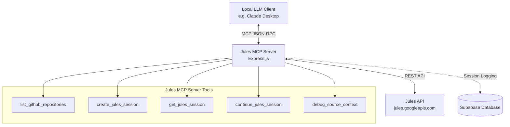

# Jules MCP Server

[](https://opensource.org/licenses/MIT)

## Introduction

Jules MCP Server is a Model Context Protocol (MCP) compatible server that acts as a bridge between your local LLM clients (like Claude Desktop) and the Jules API. It enables AI assistants to seamlessly create, inspect, and continue autonomous coding sessions directly against GitHub repositories.

## Features

- **MCP Protocol 2025-06-18 Support**: Fully compatible with the latest Model Context Protocol standard.
- **Jules API Integration**: Exposes the power of the Jules autonomous coding engine to your local AI environment.
- **Repository Context Handling**: Automatically derives source context for GitHub repositories and branches.
- **Session Persistence**: Optionally logs coding sessions to a Supabase database for long-term tracking.
- **Tool Exposing**: Provides `list_github_repositories`, `create_jules_session`, `get_jules_session`, `continue_jules_session`, and `debug_source_context` to connected clients.

## Why this project exists

Modern AI development involves interacting with codebases, but context windows are limited. The Jules API provides a powerful backend for autonomous codebase manipulation. However, getting your local LLMs (like Claude) to talk to Jules requires a bridge. This project exists to provide that bridge using the Model Context Protocol, allowing local clients to hand off complex coding tasks to the Jules engine while maintaining a seamless user experience.

## Architecture Diagram



## How it works

The Jules MCP server is built on Node.js using Express. It exposes an endpoint (`/mcp`) that accepts JSON-RPC 2.0 requests formatted according to the MCP specification.

When an LLM invokes an MCP tool, the server translates that call into an HTTP request to the upstream Jules API. For example, when `create_jules_session` is called, it constructs the necessary payload, passes along your `JULES_API_KEY`, creates the session on the Jules backend, and returns the session details to the LLM.

If Supabase is configured, it will simultaneously record session metadata (like `session_id`, `prompt`, and `status`) to a `jules_sessions` table.

## Installation

1. **Clone the repository:**
   ```bash
   git clone https://github.com/SpiffyNyanXD/jules-mcp-server.git
   cd jules-mcp-server
   ```

2. **Install dependencies:**
   ```bash
   npm install
   ```

3. **Configure Environment Variables:**
   Create a `.env` file in the root of the project:
   ```bash
   cp .env.example .env
   # Edit .env with your specific keys
   ```

4. **Start the server:**
   ```bash
   npm run build # (if any build steps exist)
   node server.js
   ```
   The server will start on port 3000 (or the port defined in your `.env`).

## Environment Variables

The server behaves differently depending on the configured environment variables:

| Variable | Description | Default |
| :--- | :--- | :--- |
| `JULES_API_KEY` | **Required.** Your authentication key for the Jules API. | *None* |
| `JULES_API_BASE` | The base URL for the Jules API. | `https://jules.googleapis.com/v1alpha` |
| `GITHUB_REPO_OWNER` | Default GitHub organization or user for sessions. | `SpiffyNyanXD` |
| `GITHUB_REPO_NAME` | Default GitHub repository name. | `jules-mcp-server` |
| `GITHUB_BRANCH` | Default branch for new coding sessions. | `main` |
| `PORT` | Port for the Express server to listen on. | `3000` |
| `SUPABASE_URL` | *Optional.* Your Supabase project URL. | *None* |
| `SUPABASE_KEY` | *Optional.* Your Supabase anon or service role key. | *None* |

## Claude Connector Setup

To use this server with Claude Desktop, you need to configure Claude to connect to it.

1. Ensure your Jules MCP server is running locally (e.g., `http://localhost:3000/mcp`).
2. Locate your Claude Desktop configuration file (`claude_desktop_config.json`).
3. Add the server under the `mcpServers` configuration using the `sse` (Server-Sent Events) or HTTP endpoint approach. *Note: Since this Express server currently uses a basic POST mechanism for `/mcp`, you will need an MCP bridge or ensure your client supports standard HTTP POST-based JSON-RPC for MCP.*

Example snippet for a compatible MCP client configuration:
```json
{
  "mcpServers": {
    "jules": {
      "command": "node",
      "args": ["/absolute/path/to/jules-mcp-server/server.js"],
      "env": {
        "JULES_API_KEY": "your_api_key_here"
      }
    }
  }
}
```
*(If running as a standalone Express server over HTTP, point your client configuration to the `http://localhost:3000/mcp` endpoint).*

## Examples

### Creating a Session via cURL
While the server is designed for MCP clients, you can interact with the Express REST routes directly for testing:

```bash
curl -X POST http://localhost:3000/create-session \
  -H "Content-Type: application/json" \
  -d '{
    "prompt": "Fix the off-by-one error in the pagination component.",
    "repository": "SpiffyNyanXD/my-project",
    "branch": "develop"
  }'
```

## Repository Structure

```
.
├── server.js        # Main Express and MCP server logic
├── package.json     # Node.js dependencies
└── README.md        # This file
```

## Roadmap

- [ ] Add support for Server-Sent Events (SSE) MCP transport.
- [ ] Support custom authentication flows for multi-tenant setups.
- [ ] Enhance Supabase integration to store deep traces of Jules interactions.
- [ ] Add comprehensive unit and integration tests.

## Contributing

Contributions are welcome! If you'd like to improve the Jules MCP Server, please open an issue first to discuss the changes you'd like to make.

1. Fork the repository.
2. Create a new branch for your feature (`git checkout -b feature/amazing-feature`).
3. Commit your changes (`git commit -m 'feat: add amazing feature'`).
4. Push to the branch (`git push origin feature/amazing-feature`).
5. Open a Pull Request.

Please ensure that you do not modify source code related to core MCP protocol handling without prior discussion.

## Security

- Never commit your `JULES_API_KEY`, `SUPABASE_URL`, or `SUPABASE_KEY` to version control.
- When running locally, ensure the `/mcp` endpoint is only accessible to trusted clients.
- If deploying to the cloud, wrap the endpoint in appropriate authentication.

If you discover a security vulnerability within this project, please email [spiffynyanxd@example.com](mailto:spiffynyanxd@example.com) directly.

## License

This project is licensed under the MIT License - see the LICENSE file for details.

## FAQ

**Q: Why does the server crash on startup?**
A: Ensure your `JULES_API_KEY` is set in your `.env` file or environment. The server requires this key to function.

**Q: Do I have to use Supabase?**
A: No. Supabase integration is completely optional. If `SUPABASE_URL` and `SUPABASE_KEY` are not provided, session persistence will simply be skipped.

**Q: Can I use this with models other than Claude?**
A: Yes! Any LLM client or agent framework that supports the Model Context Protocol (MCP) can connect to this server and leverage the Jules API.
