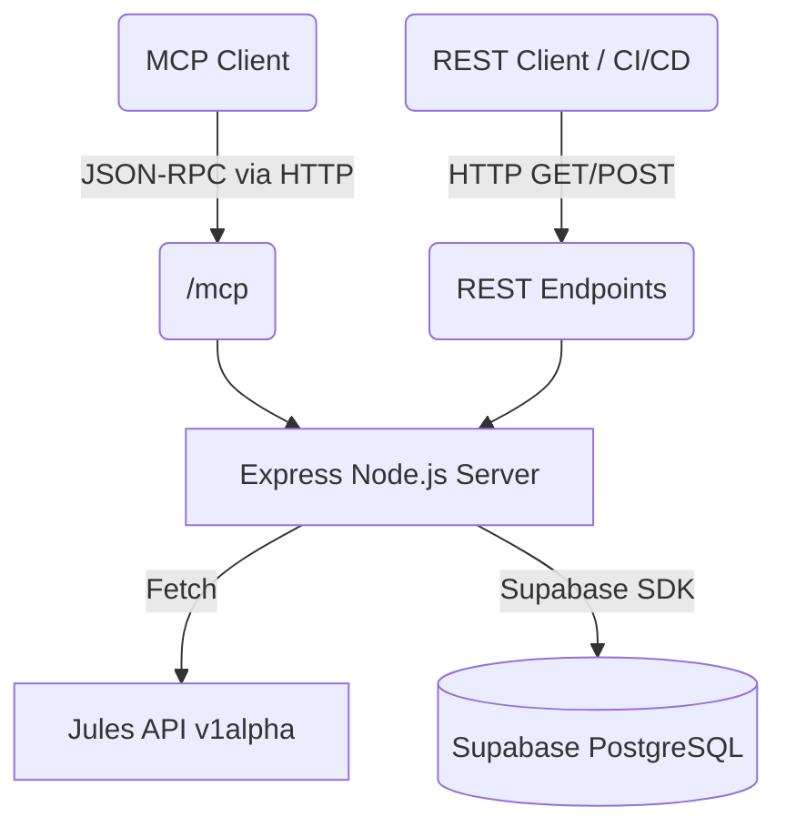

# Architecture

The Jules MCP Server acts as a bridge between your local Model Context Protocol (MCP) clients and the Jules AI API. It exposes both a standard REST API and an MCP-compliant SSE (Server-Sent Events) interface over HTTP.

State is persisted using a Supabase PostgreSQL database.

## High-Level Flow

## Components

### Express Node.js Server
The core of the application is a single `server.js` file leveraging Express. It handles routing for both REST and MCP requests, payload validation, and acts as the orchestrator.

### Jules API Integration
The server uses standard Node `fetch` to communicate with the `https://jules.googleapis.com/v1alpha` endpoints. It handles authentication via the `X-Goog-Api-Key` header mapped from the `JULES_API_KEY` environment variable.

### Supabase Persistence
To maintain session state and track task attempts, the server connects to a Supabase instance using `@supabase/supabase-js`. It stores data in a `jules_sessions` table.

### MCP Interface
The server implements the Model Context Protocol (MCP) version 2025-06-18. It utilizes the official @modelcontextprotocol/sdk providing a SSEServerTransport at the /mcp HTTP endpoint to seamlessly handle initialize, tools/list, and tools/call via SSE streams.

See [MCP Integration](./mcp.md) for tool details and [API Documentation](./api.md) for REST details.
